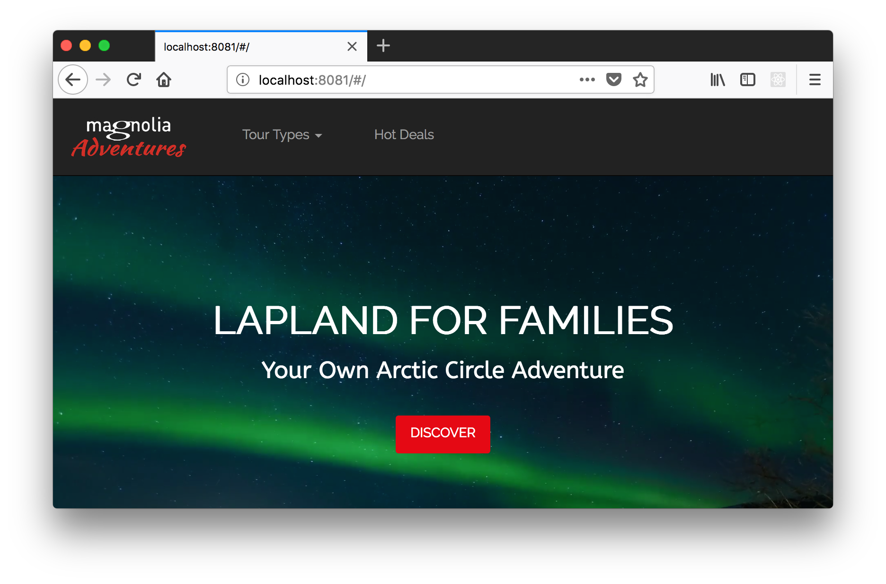

# headless-client-travel-demo - A demonstration of a headless client for the standard Magnolia travel demo

See an example of headless client getting content from a Magnolia server via the new delivery REST endpoints introduced in Magnolia CMS version 5.6

## Features

Angularjs based client. (But techniques apply to any frontend framework.)

Uses the delivery endpoint: https://documentation.magnolia-cms.com/display/DOCS56/Delivery+endpoint+API

Uses the delivery endpoint in a variety of ways:
* Filters for `featured` tours.
* Filters for tours with a specific category/tourtype.
* Grab one tour.

Uses the text location of a tour and the Google geocode service to provide a map of the location.

## Usage
The files in the `travel-spa` directory are the full single-page-app which can be run on any http server.
By default the client will use the Magnolia publicly hosted demo running at https://demopublic.magnolia-cms.com for its content.

But you can configure which server the client hits by changing the values in the `/travel-spa/app-config.js` file.

The `travel-endpoint-lm` directory is a Magnolia `light module` which provisions the REST endpoint
that the `travel-spa` client expects. (This endpoint is already present on the `demopublic` server.)
To use it on your own Magnolia instance, just drop `travel-endpoint-lm` into your instances resources directory -usually named `modules` or `light-modules`. You'll need version 5.6.1 or greater with the travel demo installed.

New to Magnolia? You can get the bundle installed in no time in the first steps of the `Hello Magnolia` tutorial. https://documentation.magnolia-cms.com/display/DOCS56/Hello+Magnolia

## Information on Magnolia CMS
https://documentation.magnolia-cms.com

## License

MIT

## Contributors

Magnolia, https://magnolia-cms.com

Iran Campos, @icdozen

Christopher Zimmermann, @topherzee
